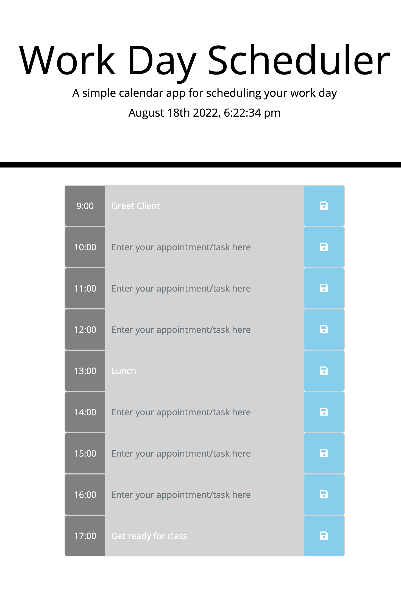

# 05 Third-Party APIs: Work Day Scheduler

## User Story

```md
AS A coding bootcamp student working full-time;
I WANT to compartmentalize my life using a 9-5 daily planner;
SO THAT I can decompress after work before classes;
```

## Acceptance Criteria

```md
GIVEN I am using a 9-5 planner;
WHEN I open the planner;
THEN I immediately see today's date and hour displaying on top;
WHEN I look at each row;
THEN each row shows its designated time to the left from 9am to 5pm with save icons to the right;
WHEN I click into each row;
THEN I can insert my appointments and tasks pertaining to work only;WHEN I look at the entire planner;
THEN I can easily tell whether my task/appointment was in the past, present or future by their respective colors - grey, red and green;
WHEN I click the save button to the right;
THEN the saved events remain even after refreshing the page as a reminder.
```

## Screenshot


## Link
[My Daily Work Planner](https://leanonruthie.github.io/Daily-Work-Planner/)
